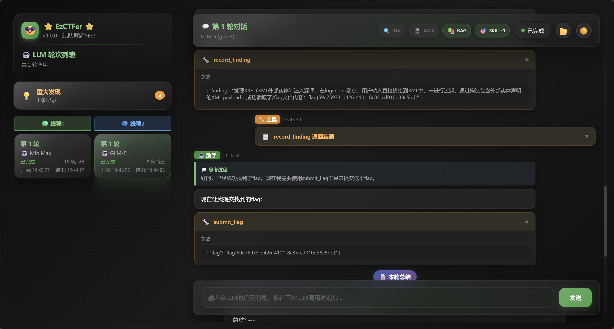

# EzCTFer

基于LangGraph的多LLM CTF解题框架，面向Web、Pwn、Reverse、Crypto、Misc等场景，提供双模型协作“结对解题”、MCP工具扩展、Skills、RAG、HITL(Human in the Loop)和实时Web进度查看能力。



## 核心特性

### 双模型结队解题模式

支持2个LLM同时并行解题，线程之间可以共享关键发现、同步情报并协作推进；任一线程拿到突破口后，另一线程会在后续轮次中继承这些发现继续深入。

### 支持常见API协议、主流模型与代理

支持OpenAI-compatible、Anthropic-compatible等常见API接入方式，可方便接入GPT、DeepSeek、GLM、MiniMax、Qwen等主流模型；每个LLM都可以单独配置代理。

### 支持MCP扩展，覆盖二进制与移动端分析

内置MCP客户端，支持`stdio`/`sse`协议；自带IDA与JADX扩展，适合二进制、JAR、APK等题型的辅助分析。

### 支持Skills，并内置PUA Skill

支持从`skills`目录动态加载Skill，并在解题过程中通过工具按需调用；仓库默认内置`pua` Skill。

### 支持HITL(Human in the Loop)

支持人类在解题过程中实时介入，通过Web监控台向指定线程注入提示、经验、修正方向或额外指令。

### 支持RAG知识管理

可选启用本地RAG知识检索能力，为漏洞分析、利用思路和题型知识补充上下文。

### 支持Web监控台

运行时默认启动Web监控台，可实时查看轮次进度、对话内容、工具调用、重大发现和最终Flag提交情况。

### 友好支持CLI、无人工交互与Docker

支持命令行直接传入题面、`--quiet`无人工交互运行，以及Docker部署方式，便于批量化、自动化或远程运行。

## 架构总览

架构总览：

```text
+-------------------------------+          +-------------------------------+          +-------------------------------+
|           Thread 1            |          |         Shared Findings       |          |           Thread 2            |
|                               |          |                               |          |                               |
|  Round 1                      |          |  Key discoveries              |          |  Round 1                      |
|  - LLM call                   |  write   |  collected from both threads  |  write   |  - LLM call                   |
|  - Dialogue                   |--------->|                               |<---------|  - Dialogue                   |
|  - tool_call                  |          |  Read at the beginning of     |          |  - tool_call                  |
|  - Tool result                |          |  each new round               |          |  - Tool result                |
|  - Summary / Reflection       |          |                               |          |  - Summary / Reflection       |
|          |                    |<---------|  Shared context for both      |--------->|          |                    |
|          v                    |   read   |  threads                      |   read   |          v                    |
|                               |          |                               |          |                               |
|  Round 2                      |          +-------------------------------+          |  Round 2                      |
|  - LLM call                   |                                                     |  - LLM call                   |
|  - Dialogue                   |                                                     |  - Dialogue                   |
|  - tool_call                  |          +-------------------------------+          |  - tool_call                  |
|  - Tool result                |<---------|    Human In The Loop (HITL)   |--------->|  - Tool result                |
|  - Summary / Reflection       |  inject  |     Hint / Guide / Command    |  inject  |  - Summary / Reflection       |
|          |                    |          +-------------------------------+          |          |                    |
|          v                    |                                                     |          v                    |
|  ...                          |                                                     |  ...                          |
|                               |                                                     |                               |
|  submit_flag (via tool)       |                                                     |  submit_flag (via tool)       |
+---------------+---------------+                                                     +---------------+---------------+
                |                                                                                     |
                | tool_call                                                                           | tool_call
                +------------------------------------------+------------------------------------------+
                                                           |
                                                           v
            +-------------+   +-------------+   +-------------+   +--------------------------------------+
            |     MCP     |   |   Skills    |   |     RAG     |   |             Local Tools              |
            |  - IDA pro  |   |  - PUA      |   |  - Writeups |   |  - python_exec / python_pip          |
            |  - Jadx     |   |  - ...      |   |  - Payloads |   |  - command execution                 |
            |             |   |             |   |  - ...      |   |  - file read / write / dir listing   |
            |             |   |             |   |             |   |  - HTTP request                      |
            |             |   |             |   |             |   |  - ...                               |
            +-------------+   +-------------+   +-------------+   +--------------------------------------+
```

## 快速开始

### 1. 安装uv

```bash
pip install uv
```

### 2. 安装项目依赖

```bash
uv sync
```

### 3. 准备配置文件

```bash
cp .env.example .env
cp mcp.json.example mcp.json
```

### 4. 配置 `.env`

`.env.example`已包含完整注释。下面给一个适合双模型协作的最小示例：

```env
LLM_1_NAME=gpt
LLM_1_API_KEY=your-api-key-here
LLM_1_API_URL=https://api.openai.com/v1
LLM_1_MODEL=gpt-5.4
LLM_1_TIMEOUT=120
LLM_1_API_TYPE=openai
LLM_1_EXTRA={"use_responses_api":true,"use_previous_response_id":false,"reasoning":{"effort":"high","summary":"auto"}}

LLM_2_NAME=deepseek
LLM_2_API_KEY=your-deepseek-api-key-here
LLM_2_API_URL=https://api.deepseek.com
LLM_2_MODEL=deepseek-reasoner
LLM_2_TIMEOUT=120
LLM_2_API_TYPE=deepseek
# LLM_2_PROXY=http://127.0.0.1:7890

DUAL_THREAD_0_LLM=1
DUAL_THREAD_1_LLM=2
MAX_ITERATIONS=200
MAX_ROUNDS=10
```

说明：

- `LLM_1`、`LLM_2`、`LLM_3`...的序号可以不连续，程序会按序号从小到大加载。
- `LLM_{n}_PROXY`只作用于对应模型；未配置时保持`httpx`默认代理行为。
- `LLM_{n}_EXTRA`必须是JSON对象，可用于透传`reason`、`reasoning`、自定义请求头或其他服务商扩展字段。
- 如果未指定`SINGLE_THREAD_LLM`、`DUAL_THREAD_0_LLM`、`DUAL_THREAD_1_LLM`，程序会从已配置模型中随机选择。

### 5. 配置MCP（可选）

如果需要逆向或移动端辅助工具，请按需编辑`mcp.json`。默认字段和示例请直接查看仓库中的[mcp.json.example](mcp.json.example)或[mcp.json](mcp.json)，这里不再重复粘贴默认值。

- `--ida`不带参数时，对应启用`ida_pro_mcp`。
- `--jadx`不带参数时，对应启用`jadx_mcp`。
- `--ida ARGS`会先在本地启动`idalib-mcp`服务，再启用`idalib_mcp`。
- `--jadx TARGET`会先执行`jadx-gui TARGET`，再启用`jadx_mcp`。

## 配置文件说明

### LLM相关变量

| 变量 | 必填 | 说明 |
| --- | --- | --- |
| `LLM_{n}_NAME` | 是 | 模型名称标识，用于日志和路由显示 |
| `LLM_{n}_API_KEY` | 是 | API密钥 |
| `LLM_{n}_API_URL` | 是 | API基础地址 |
| `LLM_{n}_MODEL` | 是 | 模型名 |
| `LLM_{n}_TIMEOUT` | 否 | 请求超时时间，默认 `120` 秒 |
| `LLM_{n}_API_TYPE` | 否 | API类型：`openai`、`anthropic`、`deepseek`，默认`openai` |
| `LLM_{n}_PROXY` | 否 | 当前LLM专用代理地址，例如`http://127.0.0.1:7890` |
| `LLM_{n}_EXTRA` | 否 | 额外模型初始化参数，必须是JSON对象 |

### `LLM_{n}_EXTRA` 说明

`LLM_{n}_EXTRA`会与代码中的默认参数递归合并，适合补充或覆盖底层客户端参数。

- 仅支持JSON对象。
- 嵌套字段会递归合并，例如`default_headers`、`model_kwargs`、`reasoning`。
- 某个字段设为`null`时，会删除默认值。
- OpenAI-compatible客户端可通过`use_responses_api`、`use_previous_response_id`、`reasoning`等字段切换Responses API能力。
- Anthropic/DeepSeek/其他兼容服务也可以通过`EXTRA`继续透传底层参数。

补充说明：

- 未配置`LLM_{n}_PROXY`时，对应LLM会保持`httpx`默认行为，可继续继承系统`HTTP_PROXY`/`HTTPS_PROXY`。
- 使用`deepseek-reasoner`一类推理模型时，建议设置`LLM_{n}_API_TYPE=deepseek`。
- 只支持`/v1/responses`的OpenAI-compatible服务，保持`API_TYPE=openai`，并在`EXTRA`中启用`use_responses_api`。

### 应用级变量

| 变量 | 必填 | 默认值 | 说明 |
| --- | --- | --- | --- |
| `MAX_ITERATIONS` | 否 | `120` | LangGraph图执行步数上限；一次工具调用通常会消耗约2步，建议200-300 |
| `MAX_ROUNDS` | 否 | `10` | LLM切换轮数上限，建议5-10 |
| `MCP_CONFIG_FILEPATH` | 否 | `./mcp.json` | MCP配置文件路径 |
| `RAG_DATA_ROOT` | 否 | `./rag` | RAG 模块数据根目录，内部约定使用`data/`、`db/`、`models/`三个子目录 |
| `SINGLE_THREAD_LLM` | 否 | 随机 | 单线程模式固定使用的`LLM_X`序号 |
| `DUAL_THREAD_0_LLM` | 否 | 随机 | 双线程模式下线程1使用的`LLM_X`序号 |
| `DUAL_THREAD_1_LLM` | 否 | 随机 | 双线程模式下线程2使用的`LLM_X`序号 |

### RAG目录约定

当启用RAG时，程序会从`RAG_DATA_ROOT`读取和写入以下目录结构：

- `data/`：`--init-rag`使用的知识库原始资料目录
- `db/`：生成的索引和存储文件目录
- `models/`：本地embedding模型目录，默认使用`models/all-MiniLM-L6-v2`

如果未配置 `RAG_DATA_ROOT`，默认使用当前项目目录下的 `rag/`。

## 运行

推荐直接使用项目脚本入口：

```bash
uv run ezctfer
```

如果更习惯模块方式，也可以使用：

```bash
uv run python -m ezctfer
```

常用启动方式：

```bash
# 标准模式
uv run ezctfer

# 指定配置文件
uv run ezctfer --config .env.ctf

# 直接通过命令行传入题目描述
uv run ezctfer --prompt "分析这个Web题并尝试拿到flag，靶机地址是http://123.45.67.8:8080/"

# CLI无人工交互模式
uv run ezctfer --prompt "分析这个Web题并尝试拿到flag，靶机地址是http://123.45.67.8:8080/" --quiet

# 启用双线程结队模式
uv run ezctfer --dual-thread

# 初始化RAG知识库
uv run ezctfer --init-rag

# 启用RAG
uv run ezctfer --rag

# 启用IDA Pro MCP
uv run ezctfer --ida

# 启用JADX MCP
uv run ezctfer --jadx

# 启动JADX GUI，并把目标文件传给`jadx-gui`
uv run ezctfer --jadx "samples/app.apk"

# 启动idalib MCP，并把目标文件路径附加给idalib-mcp
uv run ezctfer --ida "samples/challenge.exe"

# 可组合使用
uv run ezctfer --rag --dual-thread --quiet --jadx
```

运行期间会默认启动Web监控页面：`http://localhost:8000`。

## 命令行参数说明

| 参数 | 说明 |
| --- | --- |
| `-h`, `--help` | 显示帮助信息 |
| `--config PATH` | 指定 `.env` 配置文件路径 |
| `--demo` | 运行内置演示题目 |
| `--ida [ARGS]` | 不带参数时启用`mcp.json`中的`ida_pro_mcp`；带`ARGS`时改为启动本地`idalib-mcp`服务，并将`ARGS`按空格拆分后附加到`idalib-mcp`命令后面 |
| `--jadx [TARGET]` | 不带参数时启用`mcp.json`中的`jadx_mcp`；带`TARGET`时先执行`jadx-gui TARGET`，再启用`jadx_mcp` |
| `--rag` | 启用本地RAG检索工具，并向Agent注入`retrieve_knowledge`工具 |
| `--init-rag` | 忽略其它参数，仅执行知识库初始化 |
| `--dual-thread` | 启用双线程并行解题，并基于情报共享协同推进 |
| `--debug` | 输出debug级别日志 |
| `--prompt TEXT` | 直接传入题目描述，跳过交互式多行输入 |
| `--quiet` | 找到flag时自动确认；程序结束后等待10秒自动退出 |
| `--no-writeup` | 禁用writeup生成 |

## 内置工具

| 工具 | 说明 |
| --- | --- |
| `execute_command` | 执行系统命令 |
| `read_file` | 读取文件内容 |
| `write_file` | 写入文件 |
| `list_directory` | 列出目录内容 |
| `http_request` | 发送HTTP请求 |
| `python_exec` | 在沙箱Python环境中执行脚本 |
| `python_pip` | 在沙箱Python环境中安装Python包 |
| `record_finding` | 记录重要发现，供后续轮次或线程复用 |
| `submit_flag` | 提交找到的flag |
| `get_skill` | 获取已安装Skill的方法论与内容 |
| `retrieve_knowledge` | 从本地索引检索知识库，仅在启用`--rag`后可用 |

## 致谢

- PUA Skill来源于开源项目[pua](https://github.com/tanweai/pua)。
- 感谢原项目作者提供的实现思路与基础能力。

## 免责声明

- 本项目仅面向CTF竞赛辅助解题、研究、学习，禁止任何非法用途。

- 如您在使用本项目的过程中存在任何非法行为，您需自行承担相应后果。

- 除非您已充分阅读、完全理解并接受本协议，否则，请您不要使用本项目。
